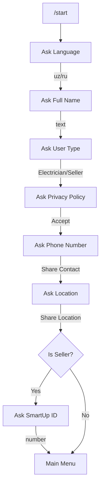

# Bot Logic & Interaction Flow

The Telegram bot is based on a structured State Machine via Aiogram's FSM (Finite State Machine).

## 🚀 The Start Process (`/start`)

When a user initiates the bot, the system checks for three conditions:
1. **New User**: Directs to the registration flow.
2. **Incomplete Registration**: Resumes from the last pending step.
3. **Existing Registered User**: Shows the Main Menu.

### 📝 Registration Flow

The registration is mandatory for all features and follows this strict sequence:

## 🔍 QR Code Scanning Logic

QR codes are handled via the `/start <hash>` command (Deep Linking) or by simply typing the code into the chat.

1. **Input**: User provides a code (e.g., `E-ABC123`).
2. **Safety Check**:
   - Check if the user is currently blocked (e.g., too many failures).
   - Check if the code is valid in PostgreSQL.
3. **Usage Check**: 
   - Is it already scanned? 
   - Does the type (E/D) match the user's role?
4. **Result**:
   - If **Success**: Credit points, notify user, reset failure counter.
   - If **Failure**: Log retry, notify user, increment failure counter.

## 🎁 Gift Catalog (Web App)

The catalog is an integrated **Telegram Web App**.
- **Browsing**: Users see only the gifts available for their specific type (Electrician vs Seller).
- **Redemption**: 
  - Submits a `GiftRedemption` request in Django.
  - Instantly recalculates the user's `total_points` using `calculate_points()`.
  - Notifies the user of the successful request.
- **Confirmation**: Once the gift is delivered physically, the user can confirm receipt directly via the Web App.

## 📊 Main Menu Commands

- **💰 Points Balance**: Shows current total points and last scan.
- **🎁 Buy Gifts**: Opens the Web App catalog.
- **🏆 Leaderboard**: Displays top 10 users globally or regionally.
- **📹 Video Instruction**: Sends a video guide based on the user's role.
- **🌐 Language**: Allows changing the UI language (`uz` or `ru`).
