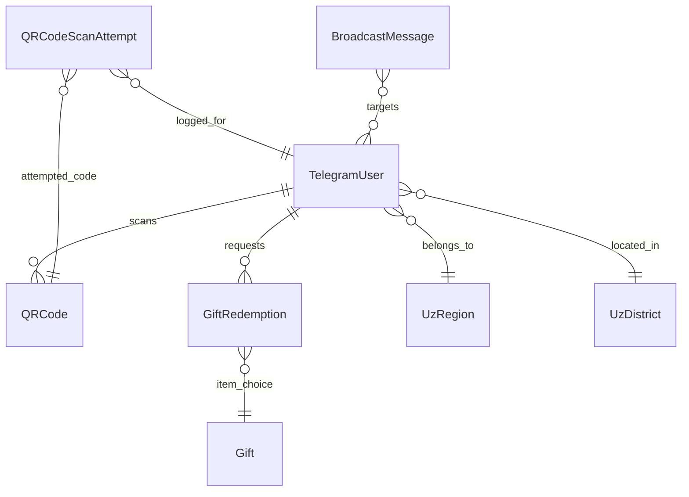

# Data Models & Schema Design

The Mono Electric system uses PostgreSQL as its main database, with a focus on historical tracking (`django-simple-history`) and geographic resolution.

## 🗃️ Core Entities

### 1. **TelegramUser**
Stores everything about the participant.
- `telegram_id`: Unique identifier (BigInt).
- `user_type`: `electrician` or `seller`.
- `points`: Current points balance (Denormalized for performance).
- `region`, `district`: Geographic lookup (ForeignKeys to `UzRegion`/`UzDistrict`).
- `smartup_id`: Required for sellers to sync with the enterprise ERP.
- `promo_failed_attempts`: Counter for security to prevent brute-forcing.
- **Key Methods**:
  - `calculate_points()`: Recalculates total earned minus spent.
  - `update_location()`: Resolves GPS coordinates into regional codes.

### 2. **QRCode (Promo Code)**
Represents the physical code found on the product.
- `code`: The printable human-readable code (e.g., `E-ABC123`).
- `hash_code`: A shortened, URL-safe version for the `start` command.
- `serial_number`: Incremental number used by the production facility (`E000001`).
- `points`: Reward value (configured at generation).
- `is_scanned`: Status flag.
- `scanned_by`: Reference to the `TelegramUser`.

### 3. **Gift & GiftRedemption**
The rewards catalog and the fulfillment pipeline.
- **Gift**: `name`, `description`, `image`, `points_cost`, `user_type` (Exclusive gifts for specific roles).
- **GiftRedemption**:
  - `user` & `gift`: Link to participant and item.
  - `status`: Lifecycle of the request (Pending -> Approved -> Sent -> Completed).
  - `admin_notes`: Operational comments for fulfillment.

### 4. **BroadcastMessage**
Bulk communication entity.
- `title`, `message_text`, `image`.
- `user_type_filter`, `region_filter`, `language_filter`: Segment targeting.
- `sent_count`, `failed_count`: Stats for reporting.

### 5. **Geography: UzRegion & UzDistrict**
Static lookup data for Uzbekistan's administrative divisions.
- `code`: Standardized region/district codes (e.g., `tashkent_city`).
- `name_uz`, `name_ru`: Multi-language names.

## 📊 Entity Relationship Diagram

## 🔐 Security Features
- **Promo Code Lock**: If a user enters an invalid code 3 times in a row, they are blocked from further attempts for 24 hours.
- **Role Validation**: Electricians cannot scan codes meant for Sellers (and vice versa).
- **History Tracking**: All changes to users, gifts, and redemptions are version-controlled via `HistoricalRecords`.
