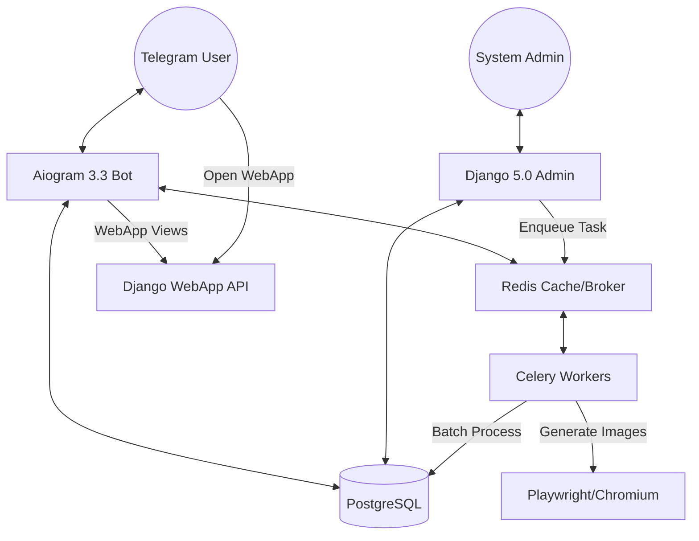

# Technical Architecture - Mono Electric Loyalty Bot

The system is built on a modern asynchronous stack with a focus on high-volume task processing and sub-second bot response times.

## 🧱 The Stack
- **Framework**: Django 5.0 (Running in Async Mode).
- **Bot Engine**: Aiogram 3.3 (Asynchronous Telegram Framework).
- **Tasks**: Celery 5.3 (Background workers for broadcasts and QR generation).
- **Database**: 
  - **PostgreSQL**: Primary relational storage.
  - **Redis**: Task broker for Celery and high-performance caching.
- **Geodata**: 
  - **OpenStreetMap / Nominatim**: For resolving coordinates to administrative districts.
  - **Poly-lookup**: Built-in logic for fast boundary-in-poly checks.
- **Image Generation**: Playwright/Chromium (Batch image rendering for printing promo codes).
- **Server**: Nginx + Uvicorn/Gunicorn.

## 🗺️ System Overview

## 🏗️ Folder Structure Details
| Directory | Responsibility |
| :--- | :--- |
| `bot/` | Contains all handlers, middleware, and state management for the Telegram bot. |
| `core/` | The heart of the Django application. Models for users, codes, gifts, and tasks. |
| `mona/` | Core project configuration (settings, URLs, ASGI/WSGI). |
| `documentations/` | Modular documentation (this folder). |
| `templates/` | HTML templates for the Admin Panel and Telegram Web App. |
| `scripts/` | Utility scripts for deployment and environment setup (e.g., `setup_ngrok.sh`). |
| `osm-data/` | Geographic boundary files for Uzbekistan. |

## ⚡ Key Technical Decisions

1. **Task Chaining**: For mass broadcasts (sending thousands of messages) and bulk QR generation (e.g., 50,000 codes at once), the system uses Celery task chaining to avoid blocking and memory spikes.
2. **Async Everything**: Both the Telegram bot and the WebApp API endpoints are designed with `async/await` to handle thousands of concurrent requests efficiently.
3. **Soft/Hard Timeouts**: Implemented in Celery workers to gracefully handle API rate limits and network latency.
4. **Playwright Batching**: Instead of launching a browser for every image, the system opens a single Chromium instance and renders QR code images in batches, significantly reducing overhead.
